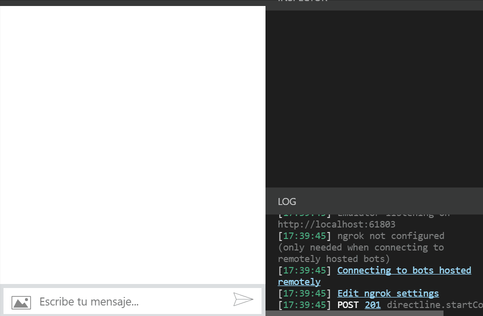

# NLP.js (`@lumen-labs-dev`)

**All packages in this repository are published on npm under the [`@lumen-labs-dev`](https://www.npmjs.com/org/lumen-labs-dev) scope.**

Install with:

```bash
npm install @lumen-labs-dev/basic
```

This monorepo is based on [NLP.js](https://github.com/axa-group/nlp.js) by its original creators. Original NLP.js attribution, contributors, and MIT license notices are preserved throughout the repository.

[](https://github.com/axa-group/nlp.js/actions/workflows/node.js.yml)
[](https://coveralls.io/github/axa-group/nlp.js?branch=master)
[](https://www.npmjs.com/package/@lumen-labs-dev/basic)
[](https://www.npmjs.com/package/@lumen-labs-dev/basic)
[](https://sonarcloud.io/dashboard?id=axa-group_nlp.js)
[](https://sonarcloud.io/dashboard?id=axa-group_nlp.js)
[](https://sonarcloud.io/dashboard?id=axa-group_nlp.js)
[](https://sonarcloud.io/dashboard?id=axa-group_nlp.js)

"NLP.js" is a general natural language utility for nodejs. Currently supporting:

- Guess the language of a phrase
- Fast _Levenshtein_ distance of two strings
- Search the best substring of a string with less _Levenshtein_ distance to a given pattern.
- Get stemmers and tokenizers for several languages.
- Sentiment Analysis for phrases (with negation support).
- Named Entity Recognition and management, multi-language support, and acceptance of similar strings, so the introduced text does not need to be exact.
- Natural Language Processing Classifier, to classify an utterance into intents.
- NLP Manager: a tool able to manage several languages, the Named Entities for each language, the utterances, and intents for the training of the classifier, and for a given utterance return the entity extraction, the intent classification and the sentiment analysis. Also, it is able to maintain a Natural Language Generation Manager for the answers.
- 40 languages natively supported, 104 languages supported with BERT integration
- Any other language is supported through tokenization, even fantasy languages



## Architecture

NLP.js v4 is split into small independent packages:

- Every language has its own package
- It provides a plugin system, so you can provide your own plugins or replace the existing ones.
- It provides a container system for the plugins, settings for the plugins and also pipelines
- A pipeline is code defining how the plugins interact. Usually it is linear: there is an input into the plugin, and this generates the input for the next one. As an example, the preparation of a utterance (the process to convert the utterance to a hashmap of stemmed features) is now a pipeline like this: `normalize -> tokenize -> removeStopwords -> stem -> arrToObj`
- There is a simple compiler for the pipelines, but they can also be built using a modified version of javascript and python (compilers are also included as plugins, so other languages can be added as a plugin).
- Some plugins can be registered by language, so for different languages different plugins will be used. Also some plugins, like NLU, can be registered not only by language but also by domain (a functional set of intents that can be trained separately)
- As an example of per-language/domain plugins, a Microsoft LUIS NLU plugin is provided. You can configure your chatbot to use the NLU from NLP.js for some languages/domains, and LUIS for other languages/domains.
- Having plugins and pipelines makes it possible to write chatbots by only modifying the configuration and the pipelines file, without modifying the code.

### TABLE OF CONTENTS

<!--ts-->

- [npm packages (`@lumen-labs-dev`)](#npm-packages-lumen-labs-dev)
- [Installation](#installation)
- [QuickStart](docs/v4/quickstart.md)
  - [Install the library](docs/v4/quickstart.md#install-the-library)
  - [Create the code](docs/v4/quickstart.md#create-the-code)
  - [Extracting the corpus into a file](docs/v4/quickstart.md#extracting-the-corpus-into-a-file)
  - [Extracting the configuration into a file](docs/v4/quickstart.md#extracting-the-configuration-into-a-file)
  - [Creating your first pipeline](docs/v4/quickstart.md#creating-your-first-pipeline)
  - [Adding multiple languages](docs/v4/quickstart.md#adding-multilanguage)
  - [Adding logic to an intent](docs/v4/quickstart.md#adding-logic-to-an-intent)
  - [Mini FAQ](docs/v4/mini-faq.md)
- [Web bundling](docs/v4/webandreact.md)
  - [Preparing to generate a bundle](docs/v4/webandreact.md#preparing-to-generate-a-bundle)
  - [Your first web NLP](docs/v4/webandreact.md#your-first-web-nlp)
  - [Creating a distributable version](docs/v4/webandreact.md#creating-a-distributable-version)
  - [Load corpus from URL](docs/v4/webandreact.md#load-corpus-from-url)
- [QnA](docs/v4/qna.md)
  - [Install the library and the qna plugin](docs/v4/qna.md#install-the-library-and-the-qna-plugin)
  - [Train and test a QnA file](docs/v4/qna.md#train-and-test-a-qna-file)
  - [Extracting the configuration into a file](docs/v4/qna.md#extracting-the-configuration-into-a-file)
  - [Exposing the bot with a Web and API](docs/v4/qna.md#exposing-the-bot-with-a-web-and-api)
- [NER Quickstart](docs/v4/ner-quickstart.md)
  - [Install the needed packages](docs/v4/ner-quickstart.md#install-the-needed-packages)
  - [Create the conf.json](docs/v4/ner-quickstart.md#create-the-confjson)
  - [Create the corpus.json](docs/v4/ner-quickstart.md#create-the-corpusjson)
  - [Create the heros.json](docs/v4/ner-quickstart.md#create-the-herosjson)
  - [Create the index.js](docs/v4/ner-quickstart.md#create-the-indexjs)
  - [Start the application](docs/v4/ner-quickstart.md#start-the-application)
  - [Stored context](docs/v4/ner-quickstart.md#stored-context)
- [NeuralNetwork](docs/v4/neural.md)
  - [Introduction](docs/v4/neural.md#introduction)
  - [Installing](docs/v4/neural.md#installing)
  - [Corpus Format](docs/v4/neural.md#corpus-format)
  - [Example of use](docs/v4/neural.md#example-of-use)
  - [Exporting trained model to JSON and importing](docs/v4/neural.md#exporting-trained-model-to-json-and-importing)
  - [Options](docs/v4/neural.md#options)
- [Logger](docs/v4/logger.md)
  - [Introduction](docs/v4/logger.md#introduction)
  - [Default logger in @lumen-labs-dev/core](docs/v4/logger.md#default-logger-in-nlpjscore)
  - [Default logger in @lumen-labs-dev/basic](docs/v4/logger.md#default-logger-in-nlpjsbasic)
  - [Adding your own logger to the container](docs/v4/logger.md#adding-your-own-logger-to-the-container)
- [@lumen-labs-dev/emoji](docs/v4/emoji.md)
  - [Introduction](docs/v4/emoji.md#introduction)
  - [Installing](docs/v4/emoji.md#installing)
  - [Example of use](docs/v4/emoji.md#example-of-use)
- [@lumen-labs-dev/similarity](docs/v4/similarity.md)
  - [Installation](docs/v4/similarity.md#installation)
  - [leven](docs/v4/similarity.md#leven)
  - [similarity](docs/v4/similarity.md#similarity)
  - [SpellCheck](docs/v4/similarity.md#spellcheck)
  - [SpellCheck trained with words trained from a text](docs/v4/similarity.md#spellcheck-trained-with-words-trained-from-a-text)
- [@lumen-labs-dev/nlu](docs/v4/nlu.md)
  - [Installation](docs/v4/nlu.md#installation)
  - [NluNeural](docs/v4/nlu.md#nluneural)
  - [DomainManager](docs/v4/nlu.md#domainmanager)
  - [NluManager](docs/v4/nlu.md#nlumanager)
- [Example of use](#example-of-use)
- [False Positives](#false-positives)
- [Log Training Progress](#log-training-progress)
- [Language Support](docs/v4/language-support.md)
  - [Supported languages](docs/v4/language-support.md#supported-languages)
  - [Sentiment Analysis](docs/v4/language-support.md#sentiment-analysis)
  - [Comparision with other NLP products](docs/v4/language-support.md#comparision-with-other-nlp-products)
  - [Example with several languages](docs/v4/language-support.md#example-with-several-languages)
- [Similar Search](docs/v4/similarity.md)
- [NLU](docs/v4/nlu.md)
- [NER Manager](docs/v4/ner-manager.md)
  - [Enum Named Entities](docs/v4/ner-manager.md#enum-entities)
  - [Regular Expression Named Entities](docs/v4/ner-manager.md#regex-entities)
  - [Trim Named Entities](docs/v4/ner-manager.md#trim-entities)
  - [Built-in entities](docs/v4/ner-manager.md#built-in-entities)
  - [Utterances with duplicated Entities](docs/v4/ner-manager.md#utterances-with-duplicated-entities)
- [NLP Manager](docs/v4/nlp-manager.md)
  - [Load/Save](docs/v4/nlp-manager.md#loadsave)
  - [Import/Export](docs/v4/nlp-manager.md#importexport)
  - [Context](docs/v4/nlp-manager.md#context)
  - [Intent Logic (Actions, Pipelines)](docs/v4/nlp-intent-logics.md)
- [Slot Filling](docs/v4/slot-filling.md)
- Languages
  - [English](https://github.com/axa-group/nlp.js/blob/master/packages/lang-en-us/README.md)
  - [Indonesian](https://github.com/axa-group/nlp.js/blob/master/packages/lang-id-id/README.md)
  - [Italian](https://github.com/axa-group/nlp.js/blob/master/packages/lang-it-it/README.md)
  - [Spanish](https://github.com/axa-group/nlp.js/blob/master/packages/lang-es-es/README.md)
- [Contributing](#contributing)
- [Contributors](#contributors)
- [Code of Conduct](#code-of-conduct)
- [Who is behind it](#who-is-behind-it)
- [License](#license)
  <!--te-->

## npm packages (`@lumen-labs-dev`)

Every installable package uses the `@lumen-labs-dev/` prefix. There is no unscoped `node-nlp` or `lang-en` package in this fork.

| Package | Purpose |
|---------|---------|
| [`@lumen-labs-dev/basic`](https://www.npmjs.com/package/@lumen-labs-dev/basic) | Primary entry point for new projects (core + common plugins) |
| [`@lumen-labs-dev/nlp`](https://www.npmjs.com/package/@lumen-labs-dev/nlp) | NLP manager plugin (used with `@lumen-labs-dev/core`) |
| [`@lumen-labs-dev/core`](https://www.npmjs.com/package/@lumen-labs-dev/core) | Container, plugin system, and pipelines |
| [`@lumen-labs-dev/lang-all`](https://www.npmjs.com/package/@lumen-labs-dev/lang-all) | All native language packages in one install |
| [`@lumen-labs-dev/lang-en-us`](https://www.npmjs.com/package/@lumen-labs-dev/lang-en-us) | English (included by `@lumen-labs-dev/basic`) |
| [`@lumen-labs-dev/node-nlp`](https://www.npmjs.com/package/@lumen-labs-dev/node-nlp) | Deprecated convenience wrapper; use `@lumen-labs-dev/basic` instead (see [Quick Start](docs/v4/quickstart.md)) |
| `@lumen-labs-dev/lang-{locale}` | Per-locale language support (see [Language Support](docs/v4/language-support.md)) |

**Language package naming:** locale packages follow `@lumen-labs-dev/lang-{language}-{region}`, for example `@lumen-labs-dev/lang-es-es`, `@lumen-labs-dev/lang-pt-pt`, and `@lumen-labs-dev/lang-pt-br`. Runtime locale codes such as `en`, `es`, or `pt` still work; they resolve to these packages automatically.

**Migrating from upstream NLP.js:** use `@lumen-labs-dev/basic` for new projects. Replace unscoped or legacy package names with the matching `@lumen-labs-dev/*` package (for example, `lang-en` becomes `@lumen-labs-dev/lang-en-us`).

## Installation

Install the v4 backend bundle:

```bash
npm install @lumen-labs-dev/basic
```

## Example of use

You can see a persisted model example in [`examples/02-qna-classic`](examples/02-qna-classic). To get started from scratch:

```javascript
const { dockStart } = require('@lumen-labs-dev/basic');

(async () => {
  const dock = await dockStart({ use: ['Basic'] });
  const nlp = dock.get('nlp');
  nlp.addLanguage('en-US');
  nlp.addDocument('en-US', 'goodbye for now', 'greetings.bye');
  nlp.addDocument('en-US', 'i must go', 'greetings.bye');
  nlp.addDocument('en-US', 'hello', 'greetings.hello');
  nlp.addDocument('en-US', 'hi', 'greetings.hello');
  nlp.addAnswer('en-US', 'greetings.bye', 'Till next time');
  nlp.addAnswer('en-US', 'greetings.hello', 'Hey there!');

  await nlp.train();
  const response = await nlp.process('en-US', 'I should go now');
  console.log(response.intent, response.score, response.answer, response.sentiment.vote);
})();
```

Example output: `greetings.bye 0.69 Till next time positive`

See the full [Quick Start](docs/v4/quickstart.md) for corpus files, pipelines, and multilanguage setup.

## False Positives

By default, the neural network tries to avoid false positives. To achieve that, one of the internal processes is that words never seen by the network are represented as a feature that gives some weight to the `None` intent. So, if you try the previous example with "_I have to go_" it will return the `None` intent because 2 of the 4 words have never been seen while training.
If you don't want to avoid those false positives, and you feel more comfortable with classifications into the intents that you declare, then you can disable this behavior by setting the `useNoneFeature` to false:

```javascript
const { dockStart } = require('@lumen-labs-dev/basic');

(async () => {
  const dock = await dockStart({
    settings: { nlu: { useNoneFeature: false } },
    use: ['Basic'],
  });
  const nlp = dock.get('nlp');
  // ...
})();
```

## Log Training Progress

You can also add a log progress, so you can trace what is happening during the training.
You can log the progress to the console:

```javascript
const { dockStart } = require('@lumen-labs-dev/basic');

(async () => {
  const dock = await dockStart({
    settings: { nlu: { log: true } },
    use: ['Basic'],
  });
  const nlp = dock.get('nlp');
  // ...
})();
```

Or you can provide your own log function:

```javascript
const { dockStart } = require('@lumen-labs-dev/basic');

const logfn = (status, time) => console.log(status, time);
(async () => {
  const dock = await dockStart({
    settings: { nlu: { log: logfn } },
    use: ['Basic'],
  });
  const nlp = dock.get('nlp');
  // ...
})();
```

## Contributing

You can read the guide for how to contribute at [Contributing](CONTRIBUTING.md).

## Contributors

[](https://github.com/axa-group/nlp.js/graphs/contributors)

Made with [contributors-img](https://contributors-img.firebaseapp.com).

## Code of Conduct

You can read the Code of Conduct at [Code of Conduct](CODE_OF_CONDUCT.md).

## Who is behind it`?`

NLP.js was originally developed by AXA Group Operations Spain S.A. This repository is maintained and published by **[Lumen Labs Dev](https://github.com/LumenLabsDev)** under the **`@lumen-labs-dev`** npm scope, while preserving original attribution and the MIT license.

## License

Copyright (c) AXA Group Operations Spain S.A.

Permission is hereby granted, free of charge, to any person obtaining
a copy of this software and associated documentation files (the
"Software"), to deal in the Software without restriction, including
without limitation the rights to use, copy, modify, merge, publish,
distribute, sublicense, and/or sell copies of the Software, and to
permit persons to whom the Software is furnished to do so, subject to
the following conditions:

The above copyright notice and this permission notice shall be
included in all copies or substantial portions of the Software.

THE SOFTWARE IS PROVIDED "AS IS", WITHOUT WARRANTY OF ANY KIND,
EXPRESS OR IMPLIED, INCLUDING BUT NOT LIMITED TO THE WARRANTIES OF
MERCHANTABILITY, FITNESS FOR A PARTICULAR PURPOSE AND
NONINFRINGEMENT. IN NO EVENT SHALL THE AUTHORS OR COPYRIGHT HOLDERS BE
LIABLE FOR ANY CLAIM, DAMAGES OR OTHER LIABILITY, WHETHER IN AN ACTION
OF CONTRACT, TORT OR OTHERWISE, ARISING FROM, OUT OF OR IN CONNECTION
WITH THE SOFTWARE OR THE USE OR OTHER DEALINGS IN THE SOFTWARE.
