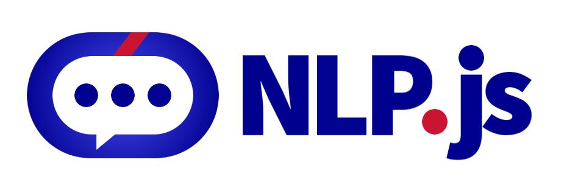

# @lumen-labs-dev/lang-id-id

**npm:** [`@lumen-labs-dev/lang-id-id`](https://www.npmjs.com/package/@lumen-labs-dev/lang-id-id) — locale language package in the [`@lumen-labs-dev`](https://www.npmjs.com/org/lumen-labs-dev) family.

[](https://github.com/axa-group/nlp.js/actions/workflows/node.js.yml)
[](https://coveralls.io/github/axa-group/nlp.js?branch=master)
[](https://www.npmjs.com/package/@lumen-labs-dev/lang-id-id)
[](https://www.npmjs.com/package/@lumen-labs-dev/lang-id-id)

## TABLE OF CONTENTS

<!--ts-->

- [Installation](#installation)
- [Language features](#language-features)
- [Sentiment analysis](#sentiment-analysis)
- [Classifier usage](#classifier-usage)
- [Contributing](#contributing)
- [Contributors](#contributors)
- [Code of Conduct](#code-of-conduct)
- [Who is behind it](#who-is-behind-it)
- [License](#license.md)
  <!--te-->

## Installation

```bash
npm install @lumen-labs-dev/lang-id-id
```

Runnable demos: [examples/13-languages/indonesian](../../examples/13-languages/indonesian/).

## Language features

```javascript
const {
  NormalizerId,
  TokenizerId,
  StopwordsId,
  StemmerId,
} = require('@lumen-labs-dev/lang-id-id');

const normalizer = new NormalizerId();
const tokenizer = new TokenizerId();
const stopwords = new StopwordsId();
const stemmer = new StemmerId();
stemmer.stopwords = stopwords;

console.log(normalizer.normalize('apa yang dikembangkan perúsahaan Anda'));
console.log(tokenizer.tokenize('apa yang dikembangkan perusahaan Anda', true));
console.log(stopwords.isStopword('yang'));
console.log(stemmer.tokenizeAndStem('apa yang dikembangkan perusahaan Anda', false));
// ['kembang', 'usaha']
```

See [language-features.js](../../examples/13-languages/indonesian/language-features.js).

## Sentiment analysis

See [11-sentiment-analysis.js](../../examples/13-languages/indonesian/11-sentiment-analysis.js).

```javascript
const { Container } = require('@lumen-labs-dev/core');
const { SentimentAnalyzer } = require('@lumen-labs-dev/sentiment');
const { LangId } = require('@lumen-labs-dev/lang-id-id');

const container = new Container();
container.use(LangId);
const sentiment = new SentimentAnalyzer({ container });
const result = await sentiment.process({ locale: 'id', text: 'saya suka kucing' });
console.log(result.sentiment.vote);
```

## Classifier usage

```javascript
const { containerBootstrap } = require('@lumen-labs-dev/core');
const { Nlp } = require('@lumen-labs-dev/nlp');
const { LangId } = require('@lumen-labs-dev/lang-id-id');

const container = await containerBootstrap();
container.use(Nlp);
container.use(LangId);
const nlp = container.get('nlp');
nlp.addLanguage('id');
nlp.addDocument('id', 'selamat tinggal', 'greetings.bye');
nlp.addDocument('id', 'halo', 'greetings.hello');
await nlp.train();
const response = await nlp.process('id', 'saya harus pergi');
```

Full walkthrough: [docs/v4/quickstart.md](../../docs/v4/quickstart.md).

## Contributing

You can read the guide of how to contribute at [Contributing](../../CONTRIBUTING.md).

## Contributors

[](https://github.com/axa-group/nlp.js/graphs/contributors)

Made with [contributors-img](https://contributors-img.firebaseapp.com).

## Code of Conduct

You can read the Code of Conduct at [Code of Conduct](../../CODE_OF_CONDUCT.md).

## Who is behind it`?`

This project is developed by AXA Group Operations Spain S.A.

Maintained by [Lumen Labs Dev](https://github.com/LumenLabsDev) under the `@lumen-labs-dev` npm scope.

## License

Copyright (c) AXA Group Operations Spain S.A.

Permission is hereby granted, free of charge, to any person obtaining
a copy of this software and associated documentation files (the
"Software"), to deal in the Software without restriction, including
without limitation the rights to use, copy, modify, merge, publish,
distribute, sublicense, and/or sell copies of the Software, and to
permit persons to whom the Software is furnished to do so, subject to
the following conditions:

The above copyright notice and this permission notice shall be
included in all copies or substantial portions of the Software.

THE SOFTWARE IS PROVIDED "AS IS", WITHOUT WARRANTY OF ANY KIND,
EXPRESS OR IMPLIED, INCLUDING BUT NOT LIMITED TO THE WARRANTIES OF
MERCHANTABILITY, FITNESS FOR A PARTICULAR PURPOSE AND
NONINFRINGEMENT. IN NO EVENT SHALL THE AUTHORS OR COPYRIGHT HOLDERS BE
LIABLE FOR ANY CLAIM, DAMAGES OR OTHER LIABILITY, WHETHER IN AN ACTION
OF CONTRACT, TORT OR OTHERWISE, ARISING FROM, OUT OF OR IN CONNECTION
WITH THE SOFTWARE OR THE USE OR OTHER DEALINGS IN THE SOFTWARE.
